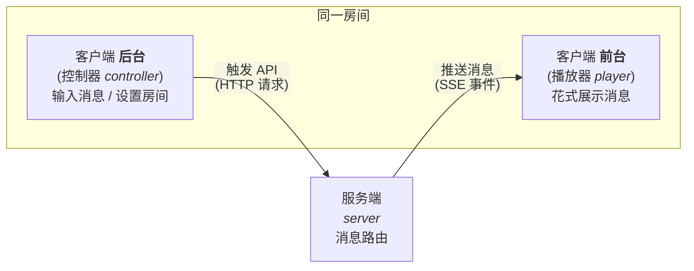

# Streaming Message

## 介绍

一个基于 [SSE](https://developer.mozilla.org/zh-CN/docs/Web/API/Server-sent_events) 的消息流 API，用于通过 web 协议实时推送消息（即 ChatGPT 前端交互的实现）

## 安装

```bash
$ git clone https://github.com/unacro/streaming-message.git
$ cd streaming-message
$ cp .env.example .env
$ bun install
$ bun run start

# or 使用其他 Node 环境
$ npm run start # 突然想起并不能 因为肆无忌惮地使用了 Bun 独有的特性 🤣
```

## 原理



## 用法

### 网页客户端

接收端访问：
```
http://localhost:8000/
```

发送端访问：
```
http://localhost:8000/admin
```

在线预览 Demo：[`sse.osrp.run`](https://sse.osrp.run/)\
发送端：[`sse.osrp.run/admin`](https://sse.osrp.run/admin)（临时 token 为 `whatever`）

### 命令行

```bash
# Linux Bash
export TMP_SSE_API="http://localhost:8000"
export TMP_SSE_TOKEN="your_super_secret_token_here"

# Windows PowerShell
$TMP_SSE_API="http://localhost:8000"
$TMP_SSE_TOKEN="your_super_secret_token_here"
```

#### 建立连接

```bash
curl -H Accept:text/event-stream "${TMP_SSE_API}/api/v1/events"
```

#### 发送消息

GET API：
```bash
curl "${TMP_SSE_API}/api/v1/send/otto?token=${TMP_SSE_TOKEN}&msg=冲！冲刺！"
```

POST API (verified by header)：
```bash
curl "$TMP_SSE_API/api/v1/send" \
  -H "Authorization: Bearer ${TMP_SSE_TOKEN}" \
  -H "Content-Type: application/json" \
  -d '{"speaker":"♿饲猫棍哥♿","data":{"message":"那我缺的营养这一块谁给我补啊？","verified_by":"Request Header"},"meta":"custom"}'
```

POST API (verified by body)：
```bash
curl "$TMP_SSE_API/api/v1/send" \
  -H "Content-Type: application/json" \
  -d '{"token":"your_super_secret_token_here","speaker":"长期素食","data":{"message":"还追！还追！移速七百多还追！！！","verified_by":"Request Body"},"meta":"custom"}'
```

## Todo

- [ ] 实现独立的会话管理系统，以允许当多个客户端同时存在时，消息互相独立
- [ ] 用 TS 重写浏览器 SSE 客户端 JS 标准实现 `sse-client.js`，编译为 ES5 作为通用库
- [ ] 前台（player）实现类似 [Echo-Live](https://github.com/sheep-realms/Echo-Live) 的 galgame 式对话框 & 打字机效果
- [ ] 后台（controller）结合 [Tailwind CSS](https://tailwindcss.com/) + [daisyUI](https://daisyui.com/) 实现交互，进行输入和房间设置
- [ ] 后台需要登录验证，JWT 双 token 模式鉴权，临时 token 6 小时，刷新 token 14 天
- [ ] 以 SQLite 作为数据库实现多用户系统
- [ ] 后台在线时服务端发送 heartbeat 心跳的 meta 元消息给前台证明细粒度（三次心跳包间隔）的实时在线状态
- [ ] 会话间分房间独立，房间 ID（不区分大小写，对齐 HTTP URL 标准）通过 path 指定，需要通过 `[a-zA-Z0-9]+` 正则验证合法性，ID 非法和不存在的房间默认 fallback 到轮询一言 API
- [ ] Dockerfile 打包容器镜像